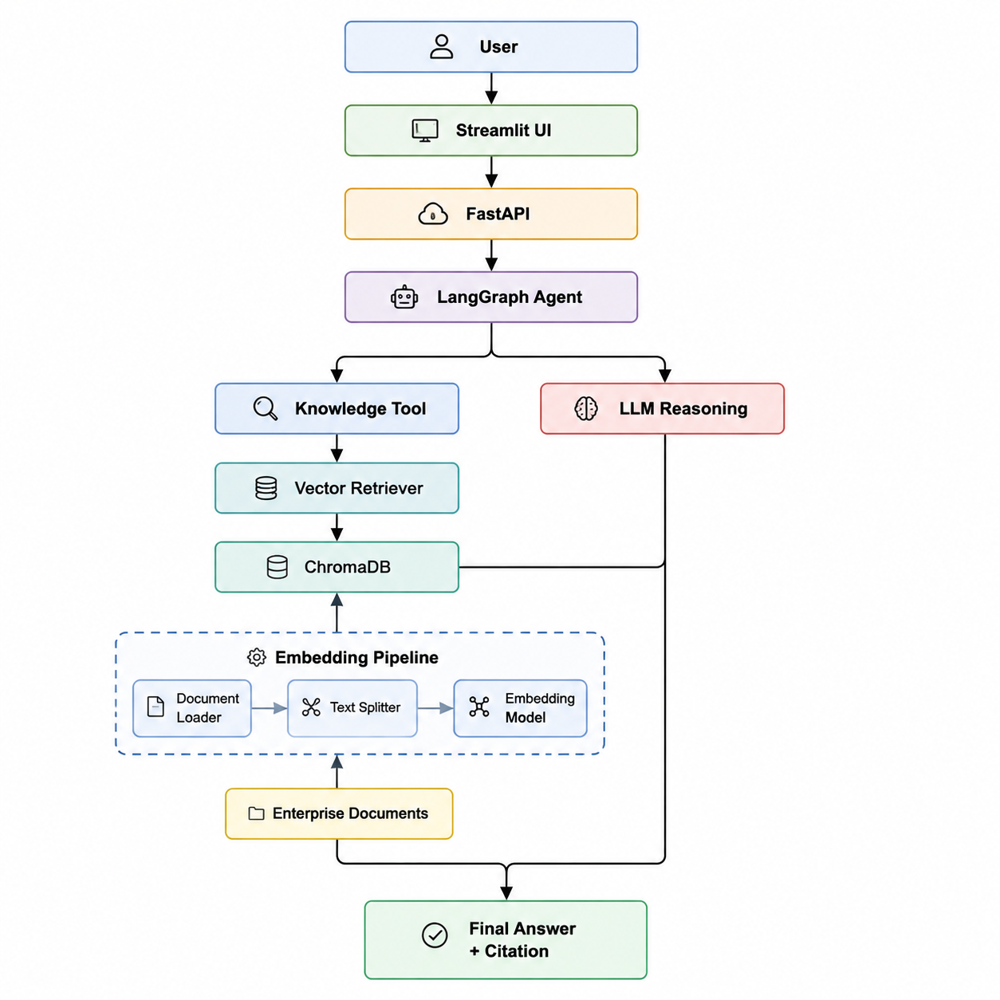
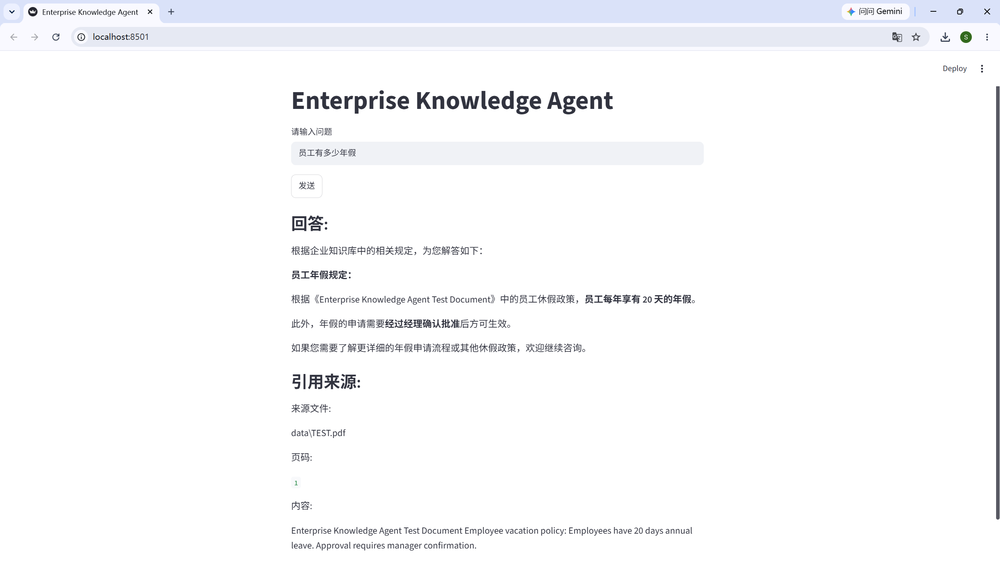

# 🤖 Enterprise Knowledge Agent

> An enterprise AI assistant powered by **RAG + LangGraph Agent**, enabling intelligent question answering over internal knowledge documents.

Enterprise Knowledge Agent is an AI-powered knowledge assistant that allows users to query enterprise documents through natural language.

The system combines **Large Language Models (LLM), Retrieval-Augmented Generation (RAG), Vector Database, Agent Workflow and Web Application**, providing accurate answers with document source references.

---

## ✨ Features

### 🧠 AI Agent Capability

- Built with **LangGraph ReAct Agent**
- Automatic reasoning and tool selection
- Knowledge retrieval tool calling
- Context-aware answer generation
- Source-aware responses


### 📚 RAG Knowledge System

- Document loading and processing
- Text chunk splitting
- Embedding generation
- Vector similarity search
- ChromaDB vector storage
- Enterprise document retrieval


### 🚀 Application Features

- FastAPI backend service
- Streamlit interactive UI
- RESTful API interface
- Environment-based configuration
- Document source citation


---

# 🏗️ System Architecture


```
                   
```


# 🔄 Agent Workflow


```
User Question

      |
      v

LangGraph Agent

      |
      |
      +---- Decide whether retrieval is required

      |
      v

Knowledge Search Tool

      |
      v

Retrieve relevant documents

      |
      v

Combine context with user query

      |
      v

LLM generates final answer

      |
      v

Response with sources

```


---

# 🛠️ Tech Stack


| Category | Technology |
|---|---|
| Language | Python |
| Agent Framework | LangGraph |
| LLM Framework | LangChain |
| Retrieval | RAG |
| Vector Database | ChromaDB |
| Backend | FastAPI |
| Frontend | Streamlit |
| Configuration | python-dotenv |
| API Server | Uvicorn |


---

# 📂 Project Structure


```
enterprise-agent/

│
├── app/
│
├── agent/
│ ├── init.py
│ ├── agent.py # LangGraph ReAct Agent workflow
│ └── tools.py # Agent tools (knowledge search)
│
├── rag/
│ ├── init.py
│ ├── loader.py # Document loading
│ ├── splitter.py # Text chunking
│ ├── pipeline.py # RAG pipeline
│ └── vectorstore.py # ChromaDB vector database
│
├── api/
│ ├── init.py
│ ├── chat.py # Chat API endpoint
│ ├── upload.py # Document upload API
│ └── routes.py # API routing
│
├── core/
│ ├── init.py
│ └── config.py # Application configuration
│
├── services/
│ └── init.py # Business services
│
├── utils/
│ └── init.py # Utility functions
│
├── frontend/
│ └── streamlit_app.py # Streamlit Web UI
│
├── data/
│ └── company.txt # Example enterprise knowledge document
│
├── docs/
│ ├── architecture.png # System architecture diagram
│ └── chat-ui.png # Web UI screenshot
│
├── requirements.txt # Python dependencies
│
├── .gitignore
│
└── README.md
```


---

# 📸 Demo




## Streamlit Interface


Add screenshot:

```
docs/
└── demo.png
```


Example:

```
User:
员工有多少天年假？


Agent:

员工每年享有20天年假。

年假申请需要经理确认。


Source:

data/TEST.pdf
Page: 1

```


---

# ⚙️ Installation


## 1. Clone Repository


```bash
git clone https://github.com/your-name/enterprise-agent.git

cd enterprise-agent
```


---

## 2. Create Virtual Environment


```bash
python -m venv venv

venv\Scripts\activate
```


---

## 3. Install Dependencies


```bash
pip install -r requirements.txt
```


---

## 4. Configure Environment Variables


Create `.env` file:


```env
OPENAI_API_KEY=your_api_key

OPENAI_BASE_URL=your_base_url
```


---

# ▶️ Run Application


## Step 1: Build Knowledge Base


```bash
python -m app.rag.pipeline
```


---

## Step 2: Start Backend


```bash
uvicorn app.main:app --reload
```


Backend:

```
http://127.0.0.1:8000
```


---

## Step 3: Start Web UI


```bash
streamlit run frontend/streamlit_app.py
```


---

# 💬 Example


### Question


```
员工有多少天年假？
```


### Agent Process


```
Question

↓

LangGraph Agent

↓

knowledge_search()

↓

Retrieve company policy

↓

Generate answer

```


### Answer


```
员工每年享有20天年假。

年假的申请需要经过经理确认。

```


---

# 🚧 Future Improvements


- [ ] Conversation memory
- [ ] Multi-document upload
- [ ] Hybrid Search (BM25 + Vector Search)
- [ ] Reranking model
- [ ] User authentication
- [ ] Docker deployment
- [ ] Cloud deployment
- [ ] Evaluation pipeline


---

# 🎯 Project Highlights


This project demonstrates practical skills in:


- LLM application development
- Retrieval-Augmented Generation (RAG)
- AI Agent workflow design
- LangGraph tool calling
- Vector database integration
- Backend API development
- AI application deployment


---

# 👨‍💻 Author


Built as an AI Engineer portfolio project demonstrating the implementation of an enterprise-level knowledge assistant.
